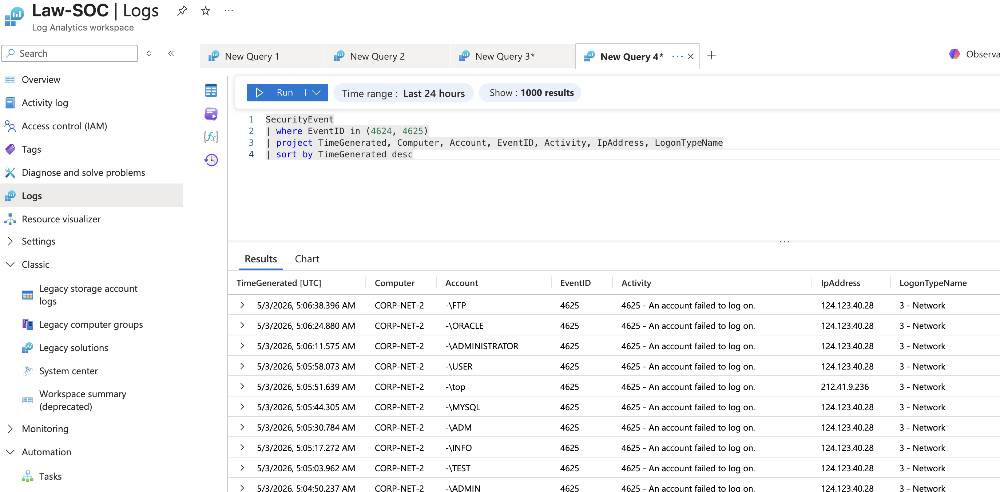
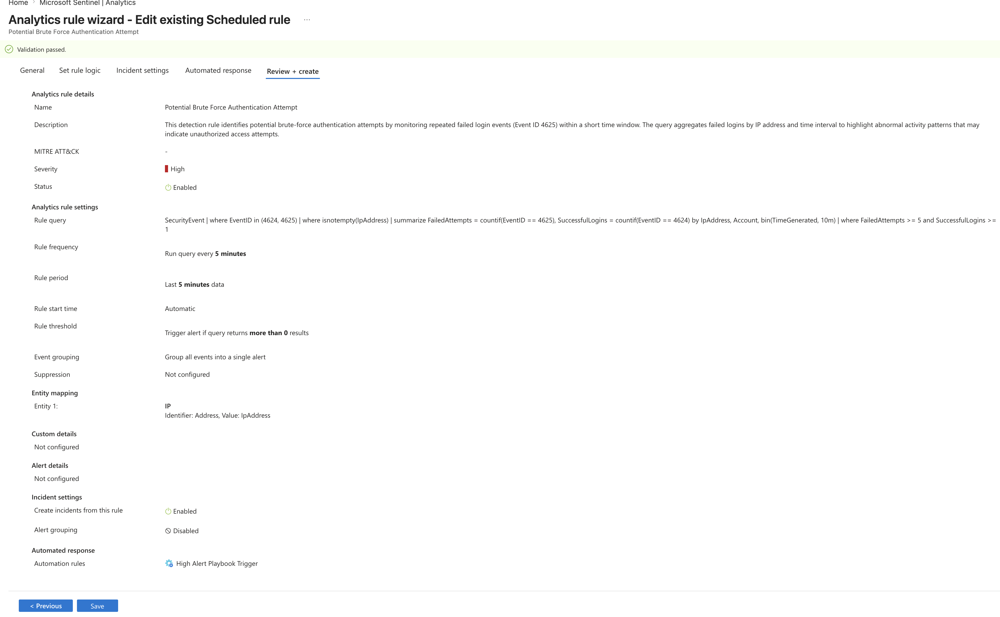
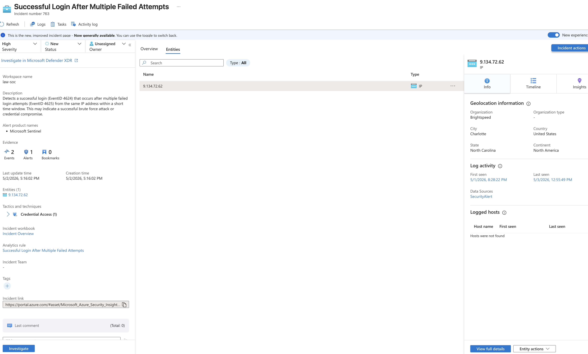

# Microsoft Sentinel Threat Detection Lab

In this project, I built a SIEM lab using Microsoft Sentinel in Azure to monitor and analyze authentication activity from a Windows virtual machine. The VM was intentionally exposed to the internet as a honeypot to attract and capture real-world login attempts.

The goal of this lab was to simulate attacker behavior, detect brute-force activity, and understand how security events are investigated in a SOC environment.

---

## 📸 Screenshots & Walkthrough

### 1. Authentication Logs Ingested

This view shows Windows Security Event logs successfully ingested into Microsoft Sentinel.  
Both successful (Event ID 4624) and failed (Event ID 4625) login attempts are visible, forming the foundation for detecting suspicious activity.

---

### 2. Failed Login Attempts (Event ID 4625)

I filtered for failed login attempts to identify repeated authentication failures.  
A high volume of failed logins within a short time window is a strong indicator of brute-force attack behavior.

---

### 3. Successful Login Events (Event ID 4624)

I correlated successful logins with previous failed attempts to identify suspicious patterns.  
A single IP address showed multiple failed attempts followed by a successful login, which strongly suggests a brute-force compromise.

---

### 4. Detection Query

I created a KQL query to detect brute-force behavior by identifying IP addresses with multiple failed logins followed by at least one successful login within a defined time window.

---

### 5. Alert / Detection Rule

A scheduled analytics rule was configured in Microsoft Sentinel to trigger alerts when suspicious login behavior is detected.  
This automates detection and simulates real SOC alerting workflows.

---

### 6. Investigation Timeline

This incident view shows alerts generated by the detection rule.  
The timeline and entity mapping provide context around the attack, allowing analysts to investigate the source IP and activity sequence.

---

### 7. VM Activity Map

This map visualizes global login attempts against the honeypot VM.  
It highlights the geographic distribution of potential attackers and reinforces the exposure of internet-facing systems.

---

## 🧠 Key Takeaways

- Built a functional SIEM lab using Microsoft Sentinel
- Simulated real-world brute-force attack behavior
- Developed KQL queries to detect suspicious login patterns
- Created automated alerting rules for threat detection
- Investigated incidents using Sentinel dashboards and entity data

---

## 🛠 Tools Used

- Microsoft Sentinel (SIEM)
- Azure Virtual Machines
- Log Analytics Workspace
- Kusto Query Language (KQL)

---

## 🚨 Skills Demonstrated

- Threat Detection
- Log Analysis
- SIEM Engineering
- Incident Investigation
- Security Monitoring
